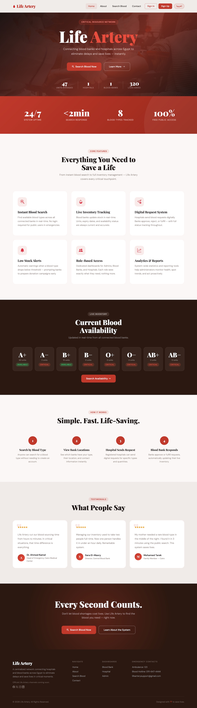
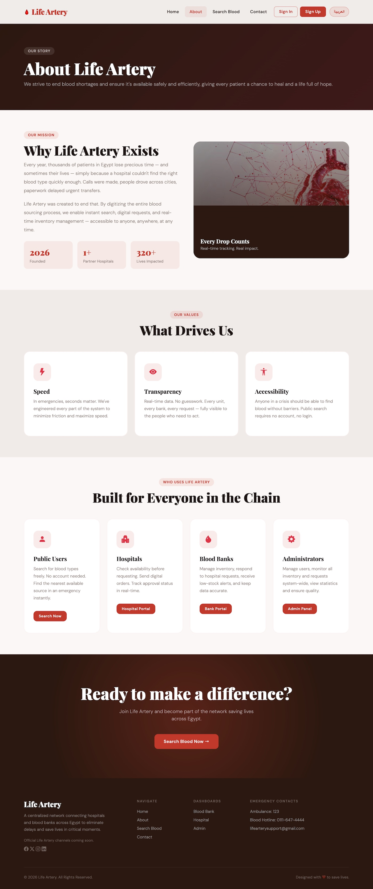
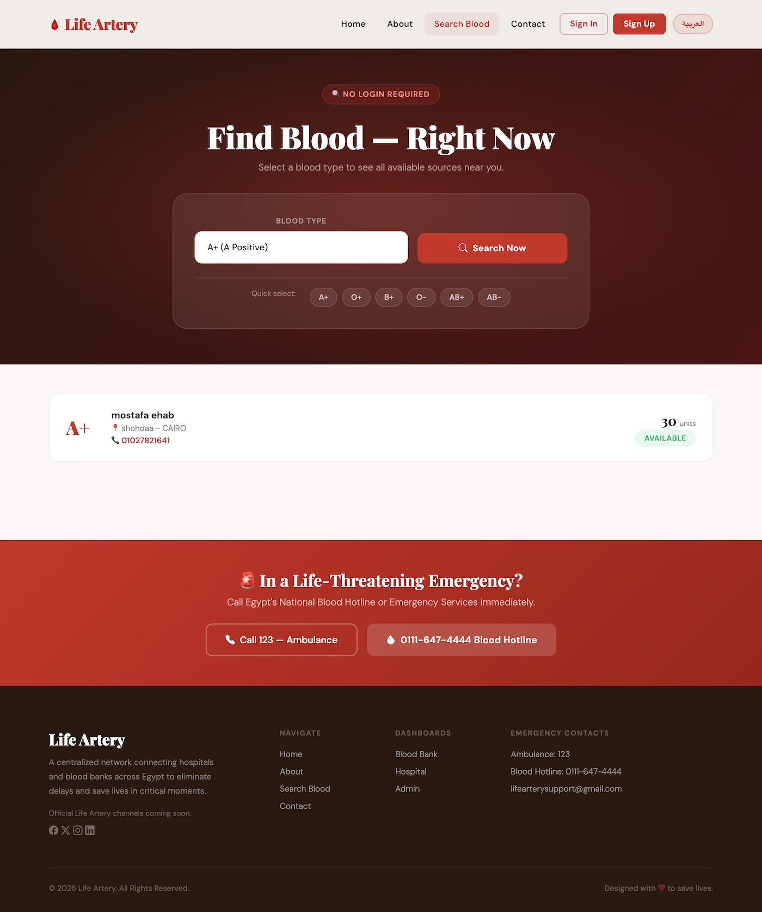
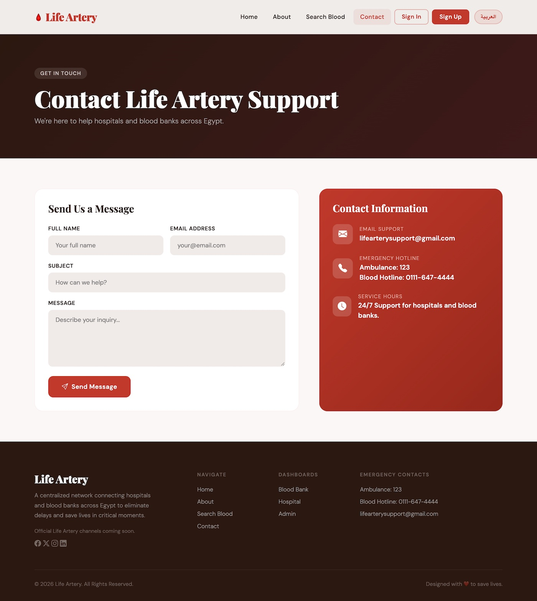
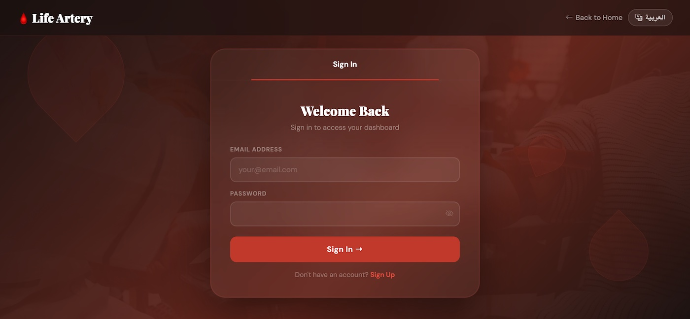
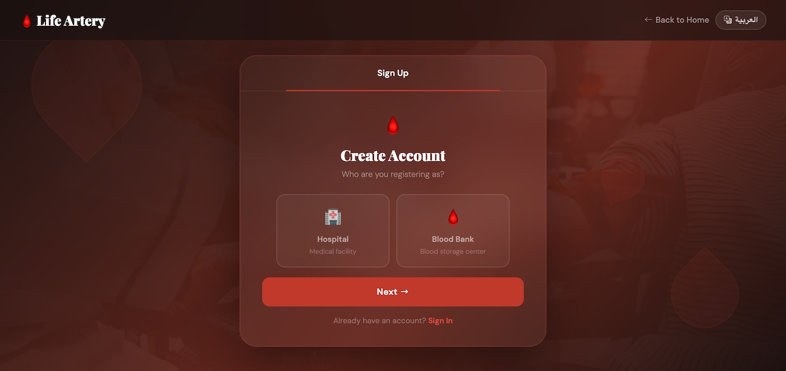
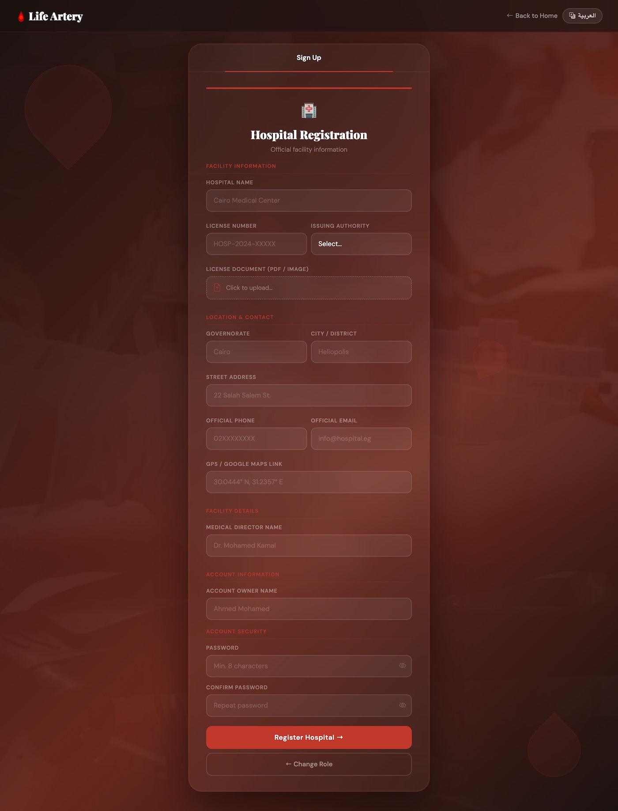
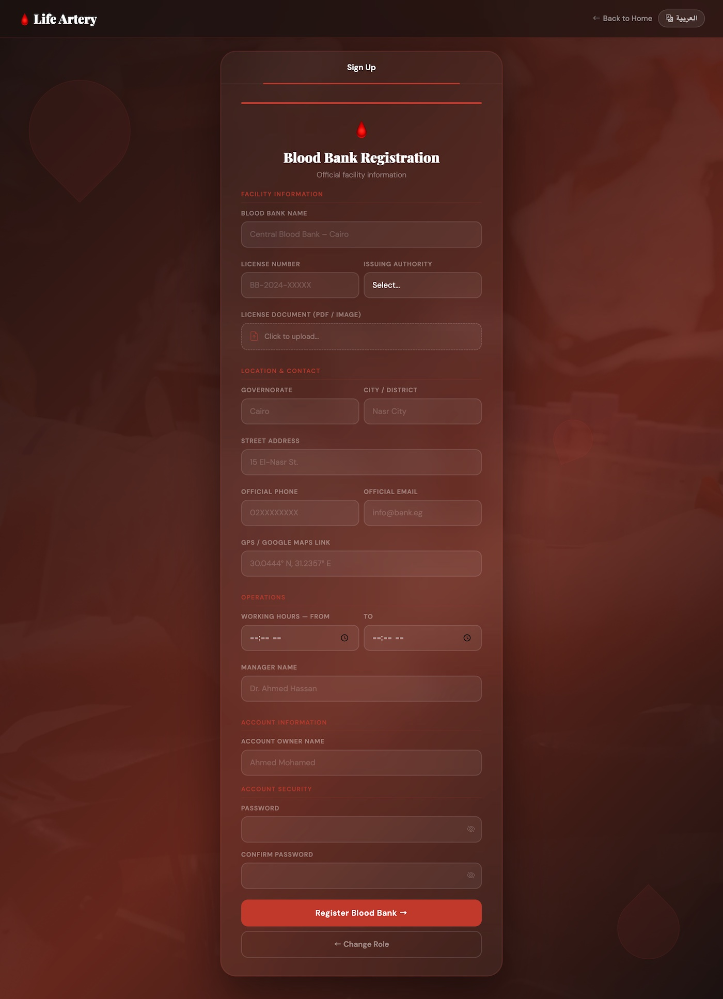
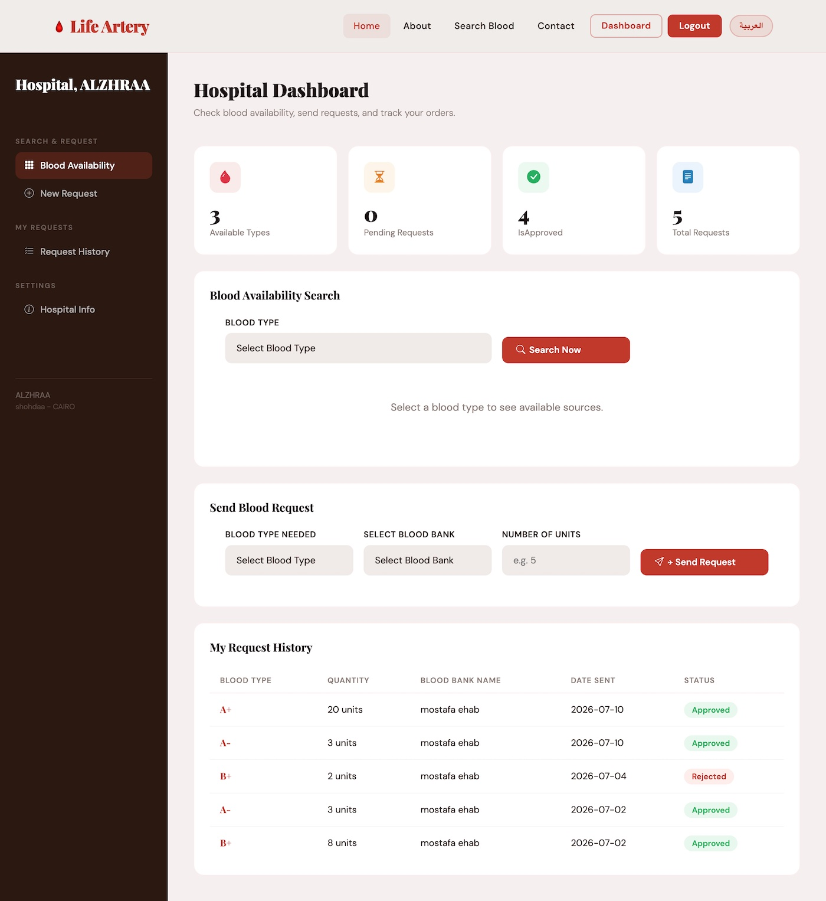
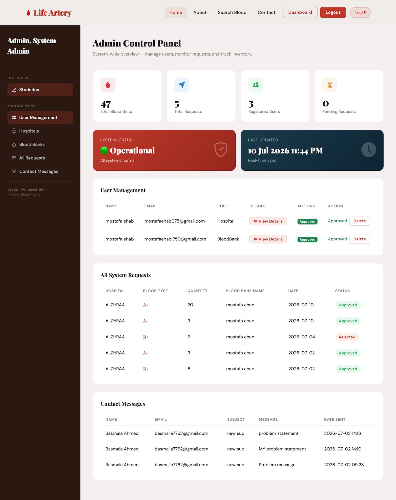

# 🩸 LifeArtery - Blood Management System | شريان الحياة

## 📌 Overview

**LifeArtery (شريان الحياة)** is a web-based Blood Management System developed to connect hospitals and blood banks through a centralized platform.

The system helps hospitals submit and track blood requests, allows blood banks to manage their blood inventory, and enables users to search for available blood units easily.

The main goal of LifeArtery is to reduce the time needed to find required blood types and improve communication between hospitals and blood banks.

---

## 💡 Project Idea

Blood shortages and difficulty finding available blood units are critical problems that can delay emergency situations.

LifeArtery provides a digital solution that helps:

- Hospitals submit and track blood requests.
- Blood banks manage blood inventory.
- Users search for available blood units.
- Administrators manage and control the system.

---

## ✨ Features

### 👨‍💼 Admin

- Manage system users.
- Approve hospital and blood bank registrations.
- Control user roles and permissions.

### 🏥 Hospitals

- Register as a hospital.
- Submit blood requests.
- Track request status.

### 🩸 Blood Banks

- Register as a blood bank.
- Manage blood inventory.
- Accept or reject blood requests.

### 👥 Public Users

- Search for available blood units.
- View blood availability information.
- Contact registered blood banks.

---

## 📸 Screenshots

### 🏠 Home Page


### ℹ️ About


### 🔍 Search Blood


### 📞 Contact


### 🔐 Sign In


### 📝 Sign Up


### 🏥 Hospital Registration


### 🩸 Blood Bank Registration


### 🏥 Hospital Dashboard


### 🩸 Blood Bank Dashboard


### 👨‍💼 Admin Dashboard


---

## 🛠️ Technologies Used

### Backend

- ASP.NET Core MVC (.NET 8)
- C#
- Entity Framework Core
- Cookie Authentication
- Role-Based Authorization

### Database

- Microsoft SQL Server

### Frontend

- HTML
- CSS
- JavaScript
- Bootstrap

### Tools

- Visual Studio
- Git & GitHub

---

## 🏗️ Project Structure

```text
LifeArtery
│
├── Controllers
├── Models
├── ViewModels
├── Views
├── Data
├── Migrations
├── wwwroot
├── Program.cs
└── appsettings.json
```

## 🔐 Security

The project implements:

- Password hashing.
- Authentication using cookies.
- Role-based authorization.
- Protected access for different user roles.

---

## 🚀 Future Improvements

- AI-based suggestions to support blood inventory management.
- Real-time notifications.
- Email and SMS notifications.
- Mobile application version.

---

## 🌐 Live Demo

🚀 Try Life Artery online:

👉 https://mostafadesha-001-site1.itempurl.com/

---

## 👥 Development Team

This project was developed by a team of four Computer Science students as part of the **Digital Egypt Pioneers Initiative (DEPI) - رواد مصر الرقمية**.

### Team Members

- Basmala Ahmed
- Shimaa Mohamed
- Mostafa Ehab
- Yousef Mohamed

---

## 🎓 About The Program

Developed as a training project during the **Digital Egypt Pioneers Initiative (DEPI)** program.

The project applies full-stack development concepts using ASP.NET Core MVC and modern web technologies.

---

## 📄 License

This project is developed for educational purposes as part of the DEPI training program.